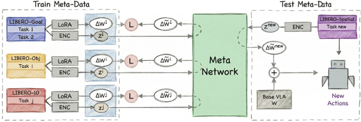

# [WIZARD: Robotic Policy Adaptation via Weight-Space Meta-Learning](https://Fascetta.github.io/WIZARD/) 🧙‍♂️✨

## TL;DR
WIZARD enables a robot to learn a new task from a single video demonstration, without any fine-tuning. It directly generates the task-specific policy parameters needed for the robot to adapt, improving performance on unseen tasks by up to **15x** compared to standard methods.

---

## 🌟 Key Contributions
WIZARD introduces a novel paradigm for robotic policy adaptation:

*   **Zero-Shot Adaptation in Weight-Space:** A new approach that generates task-specific weights directly, completely bypassing slow, gradient-based test-time fine-tuning.
*   **The WIZARD Architecture:** A meta-network that conditions a frozen Vision-Language-Action (VLA) backbone with a dynamically generated LoRA adapter, all from just a language prompt and a single demonstration video.
*   **Strong Empirical Performance:** Achieves state-of-the-art zero-shot results on the challenging LIBERO benchmark, demonstrating significant gains in generalization and efficiency (up to **~15x** on unseen tasks).

---

## 💡 The WIZARD Architecture
WIZARD re-frames robotic adaptation as a direct parameter inference problem. Instead of slow, gradient-based fine-tuning, it learns to map task evidence directly to the parameter delta (a LoRA adapter) needed to specialize a general policy. This is done in three stages:



1.  **Perception:** A multimodal encoder processes a language prompt and a single demonstration video, creating a compact "task embedding" that captures the task's semantics and kinematics.
2.  **Reasoning:** The core meta-network, the Adapter Generator, takes this task embedding and synthesizes the weights for a LoRA adapter in a single forward pass.
3.  **Action:** The generated adapter is injected into the frozen, pre-trained VLA backbone. The resulting specialized policy can then be rolled out to execute the new task, zero-shot.

---

## 📊 Quantitative Results: Zero-Shot Generalization on LIBERO-Spatial
We evaluate against standard fine-tuning under strict held-out distribution shifts. In **LIBERO-Spatial**, the baseline MT-VLA struggles to adapt without gradient updates. Conversely, WIZARD's generated adapters correctly interpret relational spatial instructions and adapt kinematics, achieving a **~2x performance increase** over the baseline entirely zero-shot.

| Method                  | T1   | T2   | T3   | T4   | T5   | T6   | T7   | T8   | T9   | T10  | Avg.   |
| :---------------------- | :--- | :--- | :--- | :--- | :--- | :--- | :--- | :--- | :--- | :--- | :----- |
| **MT-VLA** (Baseline)   | 0.22 | 0.00 | 0.56 | 0.86 | 0.00 | 0.02 | 0.00 | 0.18 | 0.02 | 0.00 | **0.19** |
| **WIZARD** (Ours)       | 0.90 | 0.12 | 0.82 | 0.84 | 0.08 | 0.28 | 0.10 | 0.76 | 0.08 | 0.00 | **0.40** |
| π₀.₅ Experts (Upper Bound) | 1.00 | 0.98 | 1.00 | 0.94 | 0.92 | 0.98 | 0.96 | 0.98 | 0.96 | 0.96 | 0.97   |

---

## 🎬 Zero-Shot Rollout Demonstrations
Here are a few examples of WIZARD performing tasks zero-shot from a single video demonstration:

| LIBERO-Spatial: Pick up the black bowl on the stove and place it on the plate | LIBERO-Object: Pick up the orange juice and place it in the basket | LIBERO-Goal: Put the wine bottle on top of the cabinet |
| :-------------------------------------------------------------------------: | :----------------------------------------------------------------: | :------------------------------------------------------: |
|  <!-- Placeholder for GIF --> |  <!-- Placeholder for GIF --> |  <!-- Placeholder for GIF --> |
| [Watch Video](static/videos/LIBERO_Spatial/task8_pick_up_the_black_bowl_on_the_stove_and_place_it_on_the_plate.mp4) | [Watch Video](static/videos/LIBERO_Object/task5_pick_up_the_orange_juice_and_place_it_in_the_basket.mp4) | [Watch Video](static/videos/LIBERO_Goal/task3_put_the_wine_bottle_on_top_of_the_cabinet.mp4) |

---

## 💻 Code, Installation & Usage (Coming Soon)

---

## 📝 Citation

If you find WIZARD useful in your research, please consider citing our work:

```bibtex
@misc{bianchi2026wizard,
    title={WIZARD: Robotic Policy Adaptation via Weight-Space Meta-Learning},
    author={Christian Bianchi and Siamak Yousefi and Alessio Sampieri and Luca Rigazio and Fabio Galasso and Luca Franco},
    year={2026},
    publisher={ItalAI Labs}
}
